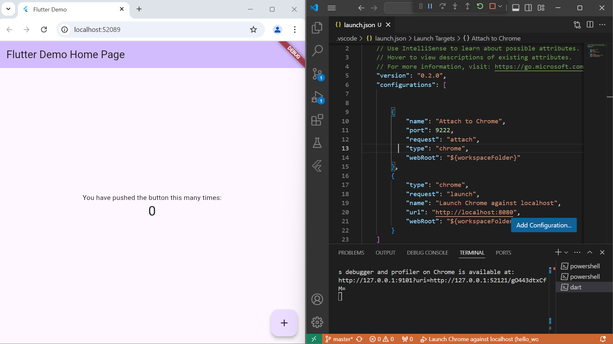
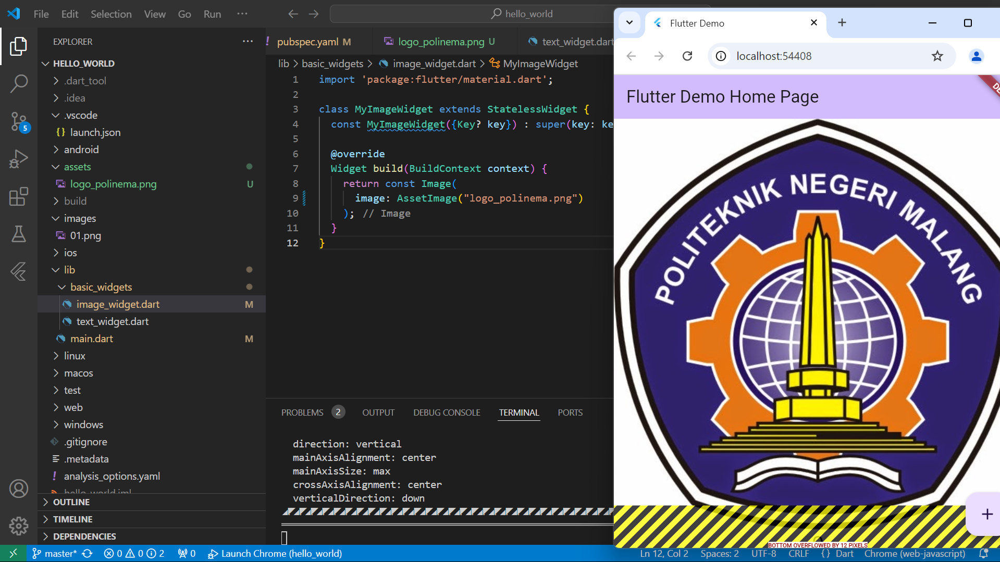
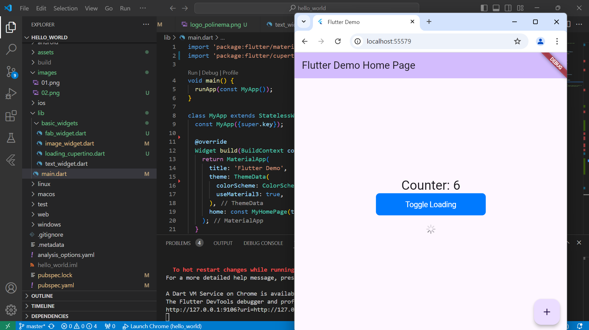
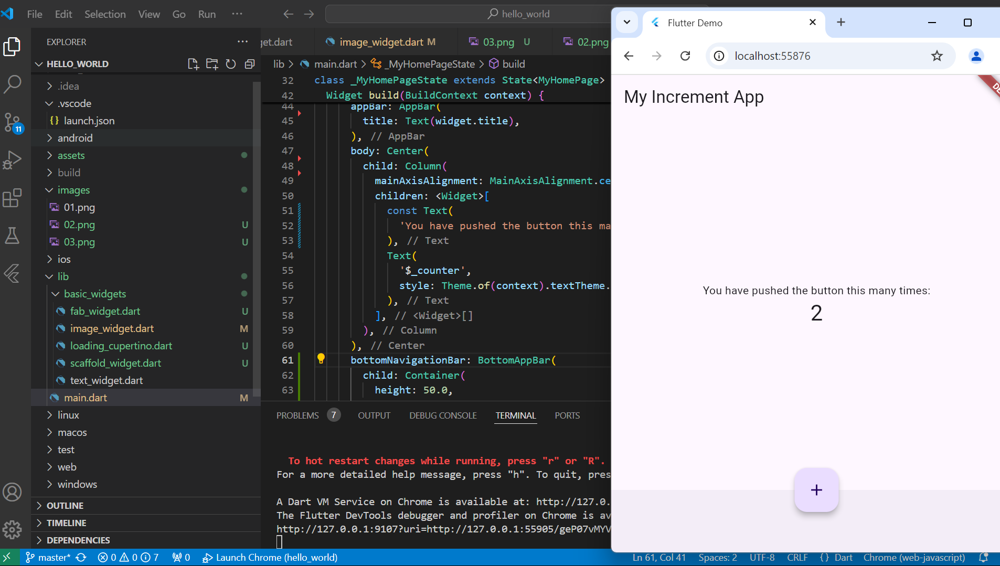
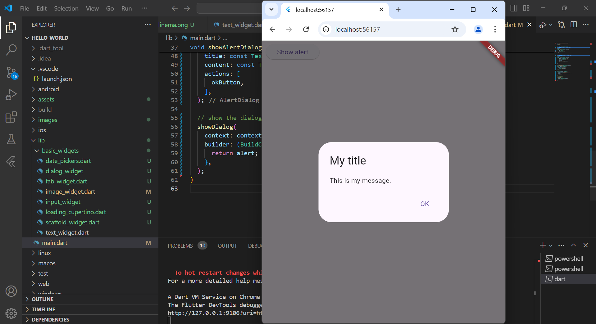
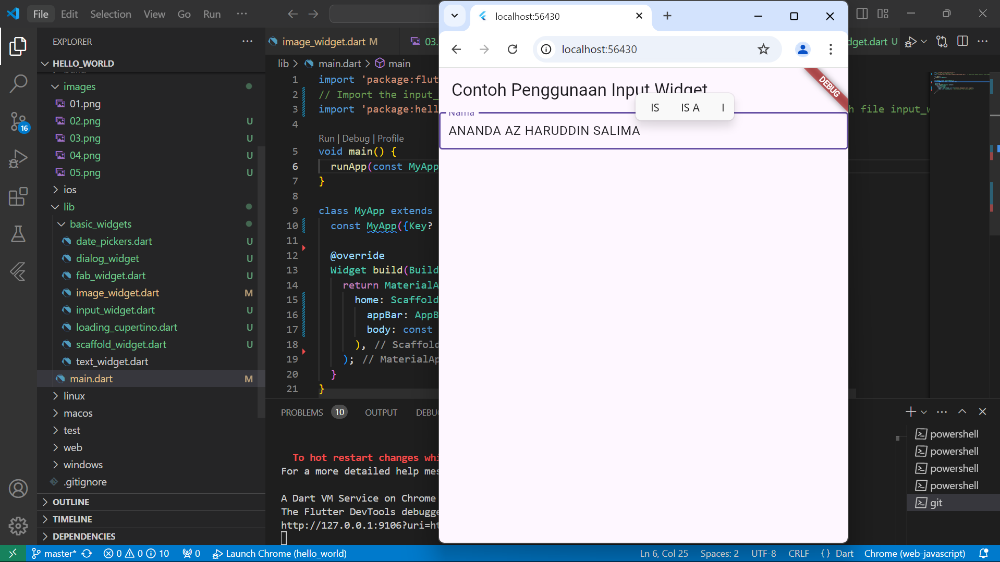
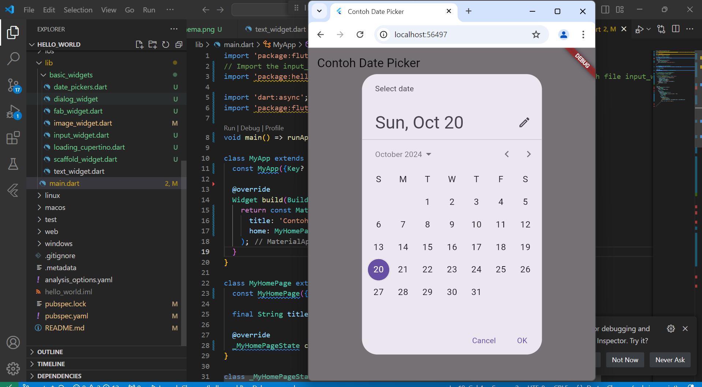

# hello_world

A new Flutter project
Praktikum 3

Menambahkan SS di readme dengan mengganti tulisan menjadi nama sendiri melalui text widget

Praktikum 4

Mengganti text widget menjadi gambar

Praktikum 4
STEP 1 Cupertino Button dan Loading Bar

Cuppertino button adalah tulisan yang bisa di klik dan tersambung ke link yang telah disambungkan

STEP 2  Floating Action Button (FAB)

Button widget terdapat beberapa macam pada flutter yaitu ButtonBar, DropdownButton, TextButton, FloatingActionButton, IconButton, OutlineButton, PopupMenuButton, dan ElevatedButton.

STEP 3 Scaffold Widget

Scaffold widget digunakan untuk mengatur tata letak sesuai dengan material design.

STEP 4 

Dialog widget pada flutter memiliki dua jenis dialog yaitu AlertDialog dan SimpleDialog

STEP 5 

Flutter menyediakan widget yang dapat menerima input dari pengguna aplikasi yaitu antara lain Checkbox, Date and Time Pickers, Radio Button, Slider, Switch, TextField.

STEP 6 

Date and Time Pickers termasuk pada kategori input dan selection widget   